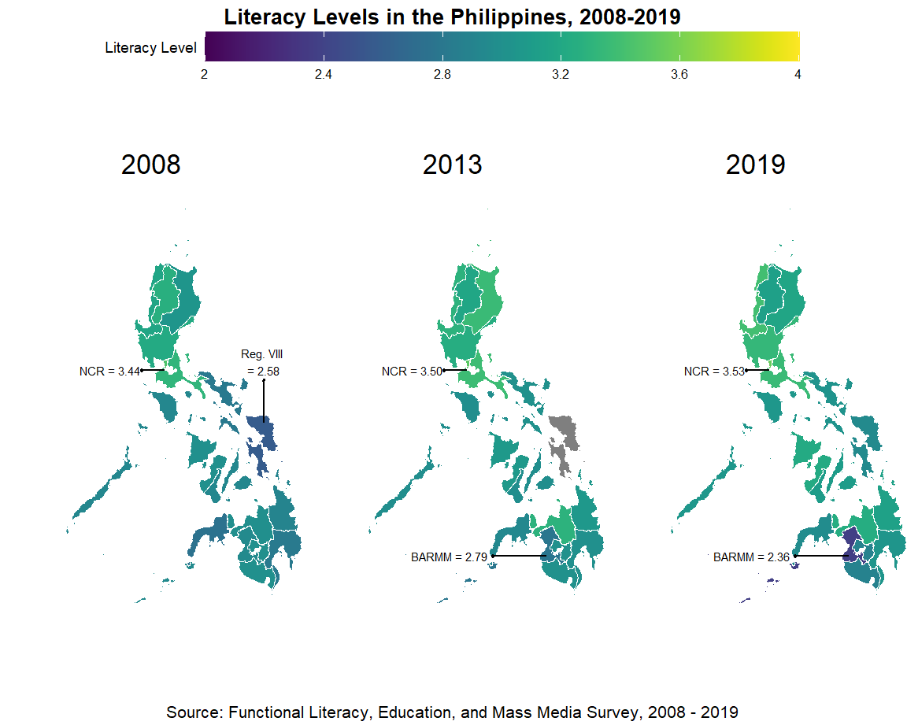
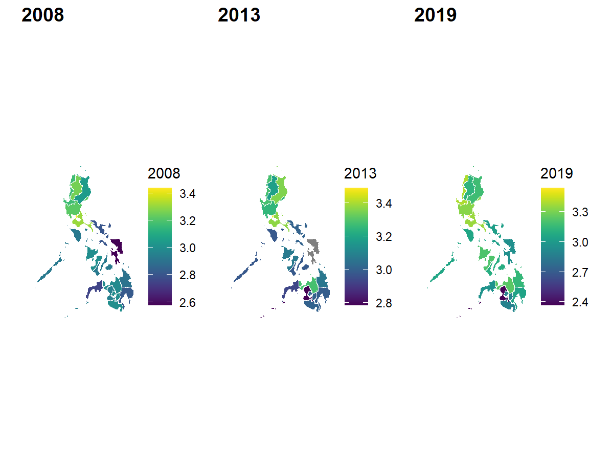

```{r setup, include=FALSE}
library(flexdashboard)
```

```{r message=FALSE, warning=FALSE, echo=FALSE}
# imports
library(rio)
library(here)
library(janitor)
library(ggplot2)
library(tidyverse)
library(skimr)
library(sf)
library(ggplot2)
library(osmdata)
library(tigris)
library(viridis)
library(tidycensus)
library(tmap)
library(elevatr)
library(ggtext)
library(tidyr)
library(knitr)
library(gt)
library(ggpubr)
library(plotly)
```

# About {data-icon="fa-solid fa-circle-info"}

## Column

### **The Project** {.no-padding}

In the 2022 assessment report of the Programme for International Student Assessment (PISA), the Philippines found itself as one of the countries that ranked lowest in reading, mathematics, and science. The dismal performance prompted the national government to launch a National Learning Recovery Program, aimed at enhancing students' reading, math, and science skills. Prior to this assessment, efforts have already been made to study Filipinos' competency at its most fundamental levels -- basic and functional literacies. These efforts aim to provide insights for both the legislative and executive branches of government to develop policies and programs that eradicate illiteracy and raise competency standards among Filipinos. This project aims to examine how functional literacy has changed over the years in the Philippines, identify areas that can be prioritized for interventions, and understand potential factors that contribute to unequal levels of functional literacy, particularly in terms of numeracy and reading comprehension -- two competencies in which the Philippines ranked poorly. Specifically, I aim to answer the following questions:

-   RQ1: How did functional literacy change in the Philippines from 2008 to 2019?
-   RQ2: How did functional literacy vary per geographic location and gender in the Philippines?
-   RQ3: What is the relationship between functional literacy and exposure to different mass media channels?

My final project uses the Functional Literacy, Education, and Mass Media Survey (FLEMMS) data from the Philippine Statistics Authority (formerly the National Statistics Office). The data is nationally representative of the Philippines literacy rates and educational skills and qualifications. It is regularly collected in line with the Philippine government's agenda to eradicate illiteracy, particularly in underserved areas. The data is publicly available via the [Philippine Statistics Authority website](https://psada.psa.gov.ph/catalog/FLEMMS/about). The following table summarizes the number of cases per dataset:

```{r message=FALSE, warning=FALSE, echo=FALSE}
df <- import(here('data', 'flemms_complete.csv')) %>%
  mutate(sex = replace(sex, as.factor(sex) == 1, 'Male'),
         sex = replace(sex, as.factor(sex) == 2, 'Female'))

df <- df %>%
  mutate(region = replace(region, region == 1, 'Region I (Ilocos Region)'),
         region = replace(region, region == 2, 'Region II (Cagayan Valley)'),
         region = replace(region, region == 3, 'Region III (Central Luzon)'),
         region = replace(region, region == 5, 'Region V (Bicol Region)'),
         region = replace(region, region == 6, 'Region VI (Western Visayas)'),
         region = replace(region, region == 7, 'Region VII (Central Visayas)'),
         region = replace(region, region == 8, 'Region VIII (Eastern Visayas)'),
         region = replace(region, region == 9, 'Region IX (Zamboanga Peninsula)'),
         region = replace(region, region == 10, 'Region X (Northern Mindanao)'),
         region = replace(region, region == 11, 'Region XI (Davao Region)'),
         region = replace(region, region == 12, 'Region XII (Soccsksargen)'),
         region = replace(region, region == 13, 'National Capital Region (NCR)'),
         region = replace(region, region == 14, 'Cordillera Administrative Region (CAR)'),
         region = replace(region, region == 15, 'Bangsamoro Autonomous Region In Muslim Mindanao (BARMM)'),
         region = replace(region, region == 16, 'Region XIII (Caraga)'),
         region = replace(region, region == 41, 'Region IV-A (Calabarzon)'),
         region = replace(region, region == 42, 'Mimaropa Region'))

phfunclit_males2008 <- df %>%
  select(c('year', 'sex', 'func_lit')) %>%
  filter(year == '2008' & sex == 'Male') %>%
  summarise(mean = mean(func_lit, na.rm = TRUE)) %>%
  pull(mean)

phfunclit_females2008 <- df %>%
  select(c('year', 'sex', 'func_lit')) %>%
  filter(year == '2008' & sex == 'Female') %>%
  summarise(mean = mean(func_lit, na.rm = TRUE)) %>%
  pull(mean)

phfunclit_males2013 <- df %>%
  select(c('year', 'sex', 'func_lit')) %>%
  filter(year == '2013' & sex == 'Male') %>%
  summarise(mean = mean(func_lit, na.rm = TRUE)) %>%
  pull(mean)

phfunclit_females2013 <- df %>%
  select(c('year', 'sex', 'func_lit')) %>%
  filter(year == '2013' & sex == 'Female') %>%
  summarise(mean = mean(func_lit, na.rm = TRUE)) %>%
  pull(mean)

phfunclit_males2019 <- df %>%
  select(c('year', 'sex', 'func_lit')) %>%
  filter(year == '2019' & sex == 'Male') %>%
  summarise(mean = mean(func_lit, na.rm = TRUE)) %>%
  pull(mean)

phfunclit_females2019 <- df %>%
  select(c('year', 'sex', 'func_lit')) %>%
  filter(year == '2019' & sex == 'Female') %>%
  summarise(mean = mean(func_lit, na.rm = TRUE)) %>%
  pull(mean)

country_average = data.frame(
  year = c(2008, 2008, 2013, 2013, 2019, 2019),
  region = c('Country Average', 'Country Average', 'Country Average', 
             'Country Average', 'Country Average', 'Country Average'),
  sex = c('Male', 'Female', 'Male', 'Female', 'Male', 'Female'),
  func_lit = c(phfunclit_males2008, phfunclit_females2008, phfunclit_males2013, phfunclit_females2013,
                       phfunclit_males2019, phfunclit_females2019))

df_scored <- df %>%
  dplyr::select(year, region, sex, func_lit) %>%
  add_row(year = 2013, region = 'Region VIII (Eastern Visayas)') %>%
  group_by(year, region) %>%
  rbind(df, country_average) %>%
  summarise(Males = mean(func_lit[sex == 'Male'], na.rm = TRUE),
            Females = mean(func_lit[sex == 'Female'], na.rm = TRUE)) %>%
  ungroup() %>%
  mutate (Males = ifelse(is.na(Males), Males[which(region == region & year == 2008)], Males),
          Females = ifelse(is.na(Females), Females[which(region == region & year == 2008)], Females)) %>%
  mutate(diff = Females - Males) 

freq_year <- table(df$year)
freq_year <- as.data.frame(freq_year)
colnames(freq_year) <- c('Year', 'N')
gt(freq_year)
```

The dataset contains questions regarding individuals' basic literacy (ability to read and write), numeracy skill, reading comprehension, media exposure, occupation, educational experiences, and socio-demographic characteristics. In this study, I analyze sex and geographic location of respondents, as well as functional literacy score and media exposure.

## Column

### **Data Overview** {data-padding="10"}

```{r}
funclit_region <- df %>%
  group_by(region) %>%
  summarize('2008 Mean' = mean(func_lit[year == 2008], na.rm = TRUE),
            '2008 SD' = sd(func_lit[year == 2008], na.rm = TRUE),
            '2013 Mean' = mean(func_lit[year == 2013], na.rm = TRUE),
            '2013 SD' = sd(func_lit[year == 2013], na.rm = TRUE),
            '2019 Mean' = mean(func_lit[year == 2019], na.rm = TRUE),
            '2019 SD' = sd(func_lit[year == 2019], na.rm = TRUE))

funclit_sex <- df %>%
  group_by(sex) %>%
  summarize('2008 Mean' = mean(func_lit[year == 2008], na.rm = TRUE),
            '2008 SD' = sd(func_lit[year == 2008], na.rm = TRUE),
            '2013 Mean' = mean(func_lit[year == 2013], na.rm = TRUE),
            '2013 SD' = sd(func_lit[year == 2013], na.rm = TRUE),
            '2019 Mean' = mean(func_lit[year == 2019], na.rm = TRUE),
            '2019 SD' = sd(func_lit[year == 2019], na.rm = TRUE))

funclit_region %>%
  gt() %>%
  fmt_number(decimals = 2) %>%
  tab_options(table.font.size = 11,
              table.width = 700) %>%
  cols_width(starts_with('region') ~ 340)

funclit_sex %>%
  gt() %>%
  fmt_number(decimals = 2) %>%
  tab_options(table.font.size = 11,
              table.width = 700) %>%
  cols_width(starts_with('sex') ~ 340)
```

# Changes in Functional Literacy {data-orientation="columns" data-icon="fa-solid fa-arrow-up-right-dots"}

## Column {.tabset}

### Final Version {data-padding="10"}

```{r message = FALSE, warning = FALSE, echo = FALSE, results='hide', eval=FALSE}
# phregions <- sf::st_read("data/Regions/phl_admbnda_adm1_psa_namria_20231106.shp") 
## code used to create object based on region-level shapefile
```

```{r eval=FALSE, message=FALSE, warning=FALSE, include=FALSE}
## code used in generating the final version of plot 1
# df_chloropleth <- df %>%
#   select(region, year, func_lit) %>%
#   pivot_wider(
#     names_from = year,
#     values_from = func_lit,
#     values_fn = ~ mean(.x, na.rm = TRUE)
#   ) %>%
#   rename('ADM1_EN' = 'region')
# 
# phregions_2 <- left_join(phregions,df_chloropleth)
# 
# litmap_2008 <- ggplot() +
#   geom_sf(data=phregions_2,aes(fill=`2008`), color = 'white', size = 0.01)+
#   theme_void() +
#   labs(fill = 'Literacy Level',
#        title = '2008') +
#   scale_fill_viridis(
#     breaks = seq(2, 4, by = .4),
#     labels = seq(2, 4, by = .4),
#     limits = c(2, 4)) +
#   geom_segment(aes(x = 121, xend = 120, y = 14.35, yend = 14.35), arrow = arrow(length = unit(.05, 'cm'))) +
#   annotate (
#     'text',
#     x = 118.8,
#     y = 14.35,
#     label = 'NCR = 3.44',
#     size = 2) +
#   geom_segment(aes(x = 125.0388, xend = 125.0388, y = 12.2446, yend = 14),
#                arrow = arrow(length = unit(.05, 'cm'))) +
#   annotate (
#     'text',
#     x = 125.0388,
#     y = 14.7,
#     label = 'Reg. VIII \n= 2.58',
#     size = 2) +
#   labs(title = '2008') +
#   theme(legend.position = 'none',
#         plot.margin = unit(c(-.5,
#                           -.25,
#                            -.5,
#                           -.25), 'cm'),
#         plot.title = element_text(hjust = .5),
#         legend.text = element_text(size = 6),
#         legend.title.align = 1,
#         legend.title = element_text(size = 7, vjust = .75),
#         legend.key.width = unit(2, 'cm'),
#         legend.key.height = unit(.5, 'cm'))
# 
# litmap_2013 <- ggplot() +
#   geom_sf(data=phregions_2,aes(fill=`2013`), color = 'white', size = 0.01)+
#   theme_void() +
#   scale_fill_viridis(
#     breaks = seq(2, 4, by = .4),
#     labels = seq(2, 4, by = .4),
#     limits = c(2, 4)) +
#   geom_segment(aes(x = 121, xend = 120, y = 14.35, yend = 14.35), arrow = arrow(length = unit(.05, 'cm'))) +
#   annotate (
#     'text',
#     x = 118.8,
#     y = 14.35,
#     label = 'NCR = 3.50',
#     size = 2) +
#   geom_segment(aes(x = 124.2422, xend = 122, y = 6.9568, yend = 6.9568),
#                arrow = arrow(length = unit(.05, 'cm'))) +
#   annotate (
#     'text',
#     x = 120.3,
#     y = 6.9568,
#     label = 'BARMM = 2.79',
#     size = 2) +
#     labs(title = '2013') +
#   theme(legend.position = 'none',
#         plot.margin = unit(c(-.5,
#                            -.25,
#                            -.5,
#                            -.25), 'cm'),
#         plot.title = element_text(hjust = .5))
# 
# litmap_2019 <- ggplot() +
#   geom_sf(data=phregions_2,aes(fill=`2019`), color = 'white', size = 0.01) +
#   labs(title = '2019') +
#   scale_fill_viridis(
#     breaks = seq(2, 4, by = .4),
#     labels = seq(2, 4, by = .4),
#     limits = c(2, 4)) +
#   geom_segment(aes(x = 121,
#                    xend = 120,
#                    y = 14.35,
#                    yend = 14.35),
#                arrow = arrow(length = unit(.05, 'cm'))) +
#   annotate (
#     'text',
#     x = 118.8,
#     y = 14.35,
#     label = 'NCR = 3.53',
#     size = 2) +
#   geom_segment(aes(x = 124.2422,
#                    xend = 122,
#                    y = 6.9568,
#                    yend = 6.9568),
#                arrow = arrow(length = unit(.05, 'cm'))) +
#   annotate (
#     'text',
#     x = 120.3,
#     y = 6.9568,
#     label = 'BARMM = 2.36',
#     size = 2) +
#   labs(title = '2019') +
#   theme_void() +
#   theme(legend.position = 'none',
#         plot.margin = unit(c(-.5,
#                            -.25,
#                            -.5,
#                            -.25), 'cm'),
#         plot.title = element_text(hjust = .5))
# 
# litmap_consolidated <- ggpubr::ggarrange(litmap_2008, litmap_2013, litmap_2019,
#                                          ncol = 3,
#                                          nrow = 1,
#                                          common.legend = TRUE)
# 
# annotate_figure(litmap_consolidated,
#                 top = text_grob("Literacy Levels in the Philippines, 2008-2019",
#                                 color = "black",
#                                 face = "bold",
#                                 size = 10),
#                 bottom = text_grob("Source: Functional Literacy, Education, and Mass Media Survey, 2008 - 2019",
#                                    color = 'black',
#                                    size = 8,
#                                    hjust = .5))

```



### Version 2 {data-padding="10"}

```{r eval=FALSE, message=FALSE, warning=FALSE, include=FALSE}
## code used in generating version 2 of plot 1 
# litmap_2008v1 <- ggplot() +
#   geom_sf(data=phregions_2,aes(fill=`2008`), color = 'white', size = 0.01)+
#     theme_void() +
#     scale_fill_viridis()
# 
# litmap_2013v1 <- ggplot() +
#   geom_sf(data=phregions_2,aes(fill=`2013`), color = 'white', size = 0.01)+
#     theme_void() +
#     scale_fill_viridis()
# 
# litmap_2019v1 <- ggplot() +
#   geom_sf(data=phregions_2,aes(fill=`2019`), color = 'white', size = 0.01) + 
#   theme_void() +
#   scale_fill_viridis()
# 
# 
# ggpubr::ggarrange(litmap_2008v1, litmap_2013v1, litmap_2019v1,
#                      labels = c("2008", "2013", "2019"),
#                      ncol = 3, nrow = 1)
```



### Version 1 {data-padding="10"}

```{r}
df %>% 
  group_by(year) %>%
  summarize(mean_score = mean(func_lit, na.rm = TRUE)) %>%
  mutate(across(everything(), ~round(., digits = 2))) %>%
  ggplot(aes(x = year, y = mean_score)) +
  geom_point() +
  geom_line() +
  labs(x = '',
       y = 'Mean Functional Literacy Score',
       title = 'Average functional literacy in the Philippines decreases in 2019') +
  scale_x_continuous(
    breaks = c(2008, 2013, 2019),
    labels = c(2008, 2013, 2019)) +
  scale_y_continuous(
    breaks = seq(0, 4, by = 1),
    labels = seq(0, 4, by = 1),
    limits = c(0, 4)
  ) +
  theme_minimal() +
  theme(
    axis.line.x = element_line(color = 'black', linewidth = 1),
    axis.line.y = element_blank(),
    axis.text.y = element_blank(),
    panel.grid.major.y = element_line(color = 'gray60', linewidth = .5, linetype = 'dotted'),
    panel.grid.major.x = element_blank(),
    panel.grid.minor = element_blank(),
  ) +
  geom_text(aes(label = mean_score),
            vjust = 2)
```

## Column {data-width="200"}

**RQ1: How did functional literacy change in the Philippines from 2008 to 2019?**

The chloropleth map shows how functional literacy scores across the Philippines changed from 2008 to 2019, based on the FLEMMS data. In general, all regions in the country had increasing functional literacy scores across all time periods, except for some regions in the Philippines which were under military conflict, such as the BARMM. Functional literacy appears to be higher in the northern parts of the Philippines compared to the southern part of the Philippines, with the most functionally literate citizens coming from the National Capital Region.

*Plot description*: Three chloropleth maps were generated to represent functional literacy scores in the Philippines. The colors, which uses the viridis color scale to aid people with color deficiencies, represent average scores per region in the functional literacy items in FLEMMS. A common legend was used to maximize the space of each map in the consolidated plot. The legend was also placed on top to minimize eye-movement. Scale values were also re-scaled from 2 to 4 to represent the integers closest to the minimum and maximum functional literacy scores. Regions with the highest and lowest functional literacy scores were also annotated in the map as a reference for viewers. The shapefile used may be found here: [PH Region Shapefile](<https://github.com/altcoder/philippines-psgc-shapefiles/blob/main/data/2023/Regions/phl_admbnda_adm1_psa_namria_20231106.shp>).

In Version 2 of the plot, the chloropleth maps generated were only consolidated without creating a common legend and title. This consumed some space and made the individual maps appear smaller.

In Version 1 of the plot, a simple line plot showing the average functional literacy score across the three time periods was generated. The magnitude of differences between years are not large, so the line plot did not convey much information, and overall was too simple.

# Literacy by Gender and Region {data-orientation="columns" data-icon="fa-solid fa-user-group"}

## Column {.tabset}

### Final Version {data-padding="10"}

```{r message=FALSE, warning=FALSE, echo=FALSE}
phfunclit_males2008 <- df %>%
  select(c('year', 'sex', 'func_lit')) %>%
  filter(year == '2008' & sex == 'Male') %>%
  summarise(mean = mean(func_lit, na.rm = TRUE)) %>%
  pull(mean)

phfunclit_females2008 <- df %>%
  select(c('year', 'sex', 'func_lit')) %>%
  filter(year == '2008' & sex == 'Female') %>%
  summarise(mean = mean(func_lit, na.rm = TRUE)) %>%
  pull(mean)

phfunclit_males2013 <- df %>%
  select(c('year', 'sex', 'func_lit')) %>%
  filter(year == '2013' & sex == 'Male') %>%
  summarise(mean = mean(func_lit, na.rm = TRUE)) %>%
  pull(mean)

phfunclit_females2013 <- df %>%
  select(c('year', 'sex', 'func_lit')) %>%
  filter(year == '2013' & sex == 'Female') %>%
  summarise(mean = mean(func_lit, na.rm = TRUE)) %>%
  pull(mean)

phfunclit_males2019 <- df %>%
  select(c('year', 'sex', 'func_lit')) %>%
  filter(year == '2019' & sex == 'Male') %>%
  summarise(mean = mean(func_lit, na.rm = TRUE)) %>%
  pull(mean)

phfunclit_females2019 <- df %>%
  select(c('year', 'sex', 'func_lit')) %>%
  filter(year == '2019' & sex == 'Female') %>%
  summarise(mean = mean(func_lit, na.rm = TRUE)) %>%
  pull(mean)

country_average = data.frame(
  year = c(2008, 2008, 2013, 2013, 2019, 2019),
  region = c('Country Average', 'Country Average', 'Country Average', 'Country Average', 'Country Average', 'Country Average'),
  sex = c('Male', 'Female', 'Male', 'Female', 'Male', 'Female'),
  func_lit = c(phfunclit_males2008, phfunclit_females2008, phfunclit_males2013, phfunclit_females2013,
                       phfunclit_males2019, phfunclit_females2019)) 

df_scored <- df %>%
  dplyr::select(year, region, sex, func_lit) %>%
  add_row(year = 2013, region = 'Region VIII (Eastern Visayas)') %>%
  group_by(year, region) %>%
  rbind(df, country_average) %>%
  summarise(Males = mean(func_lit[sex == 'Male'], na.rm = TRUE),
            Females = mean(func_lit[sex == 'Female'], na.rm = TRUE)) %>%
  ungroup() %>%
  mutate (Males = ifelse(is.na(Males), Males[which(region == region & year == 2008)], Males),
          Females = ifelse(is.na(Females), Females[which(region == region & year == 2008)], Females)) %>%
  mutate(diff = Females - Males) 

inter_rangeplot <- df_scored %>%
  ggplot() +
  geom_segment(aes(x = Males,
                   xend = Females,
                   y = reorder(region, diff, desc = F),
                   yend = reorder(region, diff, desc = F),
                   frame = year),
               size = .8, 
               color = 'gray60') +
  geom_segment(aes(x = 1,
                   xend = 4,
                   y = 8, 
                   yend = 8),
               size = .1,
               color = 'cornflowerblue',
               alpha = .2) +
  geom_point(aes(x = Males, y = region, frame = year), color = 'skyblue', size = 2) +
  geom_point(aes(x = Females, y = region, frame = year), color = 'pink', size = 2, shape = 17) +
  scale_x_continuous(
    breaks = seq(1, 4, by = 1),
    labels = seq(1, 4, by = 1),
    expand = c(0,0),
    limits = c(1, 4)) +
  labs(x =  'Functional literacy score',
       y = '',
       title = 'The National Capital Region had the smallest gap in functional literacy <br> between <span style="color:skyblue;">males</span> and <span style="color:pink;">females</span> in 2008, 2013, and 2019',
       caption = 'Source: Functional Literacy, Education, and Mass Media Survey, 2008, 2013, and 2019 <br>Note: Region VIII excluded due to damages caused by Super Typhoon Haiyan during data collection.') +
  theme(
    plot.title = element_markdown(hjust = 0, size = 10, face = 'bold'),
    plot.caption = element_text(hjust = 0),
    panel.background = element_blank(),
    panel.grid.major.x = element_line(color = 'gray70', linewidth = .01, linetype = 'dashed'),
    panel.grid.major.y = element_line(color = 'gray70', linewidth = .01, linetype = 'dashed'),
    axis.line.x = element_line(linewidth = .5, color = 'gray70'),
    axis.ticks.y = element_blank(),
    axis.text = element_text(size = 6.5),
    plot.margin = margin(t = .5,
                         r = .1,
                         b = .5,
                         l = .1, "cm")
  )

ggplotly(inter_rangeplot) %>%
  layout(margin = list(l = 50, r = 50, b = 20, t = 50),
         annotations = list(x = 1, y = -.6, text = "Source: Functional Literacy, Education, and Mass Media Survey, 2008, 2013, and 2019. <br>2008 data was used for Region VIII due to unavailability of 2013 data",
                            xref='paper', yref='paper', showarrow = F, 
                            xanchor='right', yanchor='auto', xshift=0, yshift=0,
                            font = list(size = 10)))
```

### Version 1 {data-padding="10"}

```{r}
# 2008
df_range_2008 <- df %>%
  select(c('year', 'func_lit', 'sex', 'region')) %>%
  filter(year == '2008') %>%
  group_by(region) %>%
  summarise(Males = mean(func_lit[sex == 'Male'], na.rm = TRUE),
            Females = mean(func_lit[sex == 'Female'], na.rm = TRUE)) %>%
  ungroup() %>%
  mutate(diff = Females - Males) 

df_range_2008 %>%
  ggplot() +
  geom_segment(aes(x = Males,
                   xend = Females,
                   y = reorder(region, diff, desc = F),
                   yend = reorder(region, diff, desc = F)),
               size = 1, 
               color = 'gray60') +
  geom_point(aes(x = Males, y = region), color = 'skyblue', size = 3) +
  geom_point(aes(x = Females, y = region), color = 'pink', size = 3, shape = 17) +
  scale_x_continuous(
    breaks = seq(1, 4, by = 1),
    labels = seq(1, 4, by = 1),
    expand = c(0,0),
    limits = c(1, 4)) +
  labs(x =  'Functional literacy score',
       y = '',
       title = 'In 2008, Eastern Visayas had the biggest disrepancy <br>in functional literacy bbetween <span style="color:skyblue;">males</span> and <span style="color:pink;">females</span>',
       caption = 'Source: Functional Literacy, Education, and Mass Media Survey, 2008') +
  theme(
    plot.title = element_markdown(hjust = 0, size = 10, face = 'bold'),
    plot.caption = element_text(hjust = 0),
    panel.background = element_blank(),
    panel.grid.major.x = element_line(color = 'gray70', linewidth = .1, linetype = 'dotted'),
    panel.grid.major.y = element_line(color = 'gray70', linewidth = .1, linetype = 'dotted'),
    axis.line.x = element_line(linewidth = .5, color = 'gray70'),
    axis.ticks.y = element_blank(),
    axis.text = element_text(size = 6.5),
    plot.margin = margin(t = .5,
                         r = .1,
                         b = .5,
                         l = .1, "cm")
  )
```

## Column {data-width="200"}

**RQ2: How did functional literacy vary per geographic location and gender in the Philippines?**

As shown in the plot, functional literacy consistently differed between males and females. Across all regions and time periods, females are more functionally literate than males, although such discrepancy is less pronounced in more developed regions such as the National Capital Region (NCR). From 2008 to 2013, we observed a decrease in the gap in functional literacy between males and females in most regions, but from 2013 to 2019, the gap once again increased between them. Regions commonly affected by natural calamities like typhoons exhibit the largest literacy gaps between the sexes.

*Plot description*: Range plots were generated to illustrate the differences in functional literacy scores between males and females. The x-axis represents the difference in functional literacy scores, while the y-axis displays the various regions in the Philippines, with the country-average discrepancy as a reference line. The plot is dynamic and interactive, allowing viewers to observe the discrepancy changes across three time periods. The regions are sequenced from highest to lowest discrepancy, enabling readers to quickly identify regions with the largest sex-based gaps in functional literacy. Points in the plot are differentiated by shape and color -- blue circles for males and pink triangles for females -- for easy distinction.

In Version 1 of the plot, three individual plots were generated instead of an interactive one, making it challenging to observe discrepancies over time. Therefore, interactive plots were employed to facilitate such observations. Additionally, reducing the size of points in the plot addressed difficulties in discerning gaps between males and females in regions with small differences in functional literacy scores, such as NCR. The 2008 visualization is shown as an example of the first version of the plot.

# Media Correlates of Literacy {data-icon="fa-solid fa-newspaper"}

## Column {.tabset}

### Final Version {data-padding="10"}

```{r message=FALSE, warning=FALSE, echo=FALSE}
df2009 = subset(df, year == '2008')
df2013 = subset(df, year == '2013')
df2019 = subset(df, year == '2019')

internet_lit <- df %>%
  select(c('year', 'region', 'func_lit', 'media_internet')) %>%
  group_by(year, region) %>% 
  summarize(mean_score = mean(func_lit, na.rm = TRUE),
            mean_internet = mean(media_internet, na.rm = TRUE)) %>%
  ggplot(aes(x = mean_internet, 
             y = mean_score, 
             color = as.factor(year))) +
  geom_point(alpha = .5, size = 2) +
  geom_smooth(method = 'lm', se = F, size = .5, alpha = .3) +
  labs(x = 'Average internet use', 
       y = 'Mean functional literacy score',
       color = 'Year') +
  scale_color_viridis_d() +
  scale_y_continuous(
    breaks = seq(0, 4, by = 1),
    labels = seq(0, 4, by = 1),
    expand = c(0,0),
    limits = c(0, 4)) +
  scale_x_continuous(
    breaks = seq(0, 4, by = 1),
    labels = seq(0, 4, by = 1),
    expand = c(0,0),
    limits = c(0, 4)) +  
  theme(
    plot.title = element_markdown(face = 'bold'),
    plot.caption = element_text(hjust = 0),
    axis.line = element_line(linewidth = .2, color = 'gray50'),
    axis.title = element_text(size = 7),
    axis.ticks = element_line(linewidth = .2, color = 'gray50'),
    axis.text = element_text(size = 5),
    panel.grid.major = element_line(color = 'gray70', linewidth = .1, linetype = 'dotted'),
    panel.background = element_blank(),
    legend.position = 'top',
    legend.key = element_blank(),
    legend.margin = margin(l = -1)
  )

newspaper_lit <- df %>%
  select(c('year', 'region', 'func_lit', 'media_newspaper')) %>%
  group_by(year, region) %>% 
  summarize(mean_score = mean(func_lit, na.rm = TRUE),
            mean_newspaper = mean(media_newspaper, na.rm = TRUE)) %>%
  ggplot(aes(x = mean_newspaper, 
             y = mean_score, 
             color = as.factor(year))) +
  geom_point(alpha = .5, size = 2) +
  geom_smooth(method = 'lm', se = F, size = .5, alpha = .3) +
  labs(x = 'Average newspaper consumption', 
       y = 'Mean functional literacy score',
       color = 'Year') +
  scale_color_viridis_d() +
  scale_y_continuous(
    breaks = seq(0, 4, by = 1),
    labels = seq(0, 4, by = 1),
    expand = c(0,0),
    limits = c(0, 4)) +
  scale_x_continuous(
    breaks = seq(0, 4, by = 1),
    labels = seq(0, 4, by = 1),
    expand = c(0,0),
    limits = c(0, 4)) +  
  theme(
    plot.title = element_markdown(face = 'bold'),
    plot.caption = element_text(hjust = 0),
    axis.line = element_line(linewidth = .2, color = 'gray50'),
    axis.title = element_text(size = 7),
    axis.ticks = element_line(linewidth = .2, color = 'gray50'),
    axis.text = element_text(size = 5),
    panel.grid.major = element_line(color = 'gray70', linewidth = .1, linetype = 'dotted'),
    panel.background = element_blank(),
    legend.position = 'top',
    legend.key = element_blank(),
    legend.margin = margin(l = -1)
  )

tv_lit <- df %>%
  select(c('year', 'region', 'func_lit', 'media_tv')) %>%
  group_by(year, region) %>% 
  summarize(mean_score = mean(func_lit, na.rm = TRUE),
            mean_tv = mean(media_tv, na.rm = TRUE)) %>%
  ggplot(aes(x = mean_tv, 
             y = mean_score, 
             color = as.factor(year))) +
  geom_point(alpha = .5, size = 2) +
  geom_smooth(method = 'lm', se = F, size = .5, alpha = .3) +
  labs(x = 'Average tv watching', 
       y = 'Mean functional literacy score',
       color = 'Year') +
  scale_color_viridis_d() +
  scale_y_continuous(
    breaks = seq(0, 4, by = 1),
    labels = seq(0, 4, by = 1),
    expand = c(0,0),
    limits = c(0, 4)) +
  scale_x_continuous(
    breaks = seq(0, 4, by = 1),
    labels = seq(0, 4, by = 1),
    expand = c(0,0),
    limits = c(0, 4)) +  
  theme(
    plot.title = element_markdown(face = 'bold'),
    plot.caption = element_text(hjust = 0),
    axis.line = element_line(linewidth = .2, color = 'gray50'),
    axis.title = element_text(size = 7),
    axis.ticks = element_line(linewidth = .2, color = 'gray50'),
    axis.text = element_text(size = 5),
    panel.grid.major = element_line(color = 'gray70', linewidth = .1, linetype = 'dotted'),
    panel.background = element_blank(),
    legend.position = 'top',
    legend.key = element_blank(),
    legend.margin = margin(l = -1)
  )

radio_lit <- df %>%
  select(c('year', 'region', 'func_lit', 'media_radio')) %>%
  group_by(year, region) %>% 
  summarize(mean_score = mean(func_lit, na.rm = TRUE),
            mean_radio = mean(media_radio, na.rm = TRUE)) %>%
  ggplot(aes(x = mean_radio, 
             y = mean_score, 
             color = as.factor(year))) +
  geom_point(alpha = .5, size = 2) +
  geom_smooth(method = 'lm', se = F, size = .5, alpha = .3) +
  labs(x = 'Average radio listening', 
       y = 'Mean functional literacy score',
       color = 'Year') +
  scale_color_viridis_d() +
  scale_y_continuous(
    breaks = seq(0, 4, by = 1),
    labels = seq(0, 4, by = 1),
    expand = c(0,0),
    limits = c(0, 4)) +
  scale_x_continuous(
    breaks = seq(0, 4, by = 1),
    labels = seq(0, 4, by = 1),
    expand = c(0,0),
    limits = c(0, 4)) +  
  theme(
    plot.title = element_markdown(face = 'bold'),
    plot.caption = element_text(hjust = 0),
    axis.line = element_line(linewidth = .2, color = 'gray50'),
    axis.title = element_text(size = 7),
    axis.ticks = element_line(linewidth = .2, color = 'gray50'),
    axis.text = element_text(size = 5),
    panel.grid.major = element_line(color = 'gray70', linewidth = .1, linetype = 'dotted'),
    panel.background = element_blank(),
    legend.position = 'top',
    legend.key = element_blank(),
    legend.margin = margin(l = -1)
  )

mediacorr_consolidated <- ggpubr::ggarrange(tv_lit, newspaper_lit, radio_lit, internet_lit,
                     ncol = 2, nrow = 2,
                  common.legend = TRUE) 

annotate_figure(mediacorr_consolidated, 
                top = text_grob("Media use is positively associated with functional literacy", color = "black", face = "bold", size = 10, hjust = .5),
                bottom = text_grob("Source: Functional Literacy, Education, and Mass Media Survey, 2008 - 2019",
                                   color = 'black',
                                   size = 8,
                                   hjust = .5))
```

### Version 1 {data-padding="10"}

```{r}
df %>%
  select(c('year', 'region', 'func_lit', 'media_internet')) %>%
  group_by(year, region) %>% 
  summarize(mean_score = mean(func_lit, na.rm = TRUE),
            mean_internet = mean(media_internet, na.rm = TRUE)) %>%
  ggplot(aes(x = mean_score, 
             y = mean_internet, 
             color = as.factor(year))) +
  geom_point(alpha = .5, size = 4) +
  labs(x = 'Mean functional literacy score',
       y = 'Average internet use',
       color = 'Year',
       title = 'Internet use is positively associated with literacy scores',
       subtitle = "Filipinos' internet use have also increased over the years", 
       caption = 'Source: Functional Literacy, Education, and Mass Media Survey, 2008-2019') +
  scale_color_viridis_d() +
  scale_y_continuous(
    breaks = seq(0, 4, by = 1),
    labels = seq(0, 4, by = 1),
    expand = c(0,0),
    limits = c(0, 4)) +
  scale_x_continuous(
    breaks = seq(0, 4, by = 1),
    labels = seq(0, 4, by = 1),
    expand = c(0,0),
    limits = c(0, 4)) +  
  theme(
    plot.title = element_markdown(face = 'bold'),
    plot.caption = element_text(hjust = 0),
    axis.line = element_line(linewidth = .5),
    panel.grid.major = element_line(color = 'gray70', linewidth = .1, linetype = 'dotted'),
    panel.background = element_blank(),
    legend.position = 'top',
    legend.justification = 'left',
    legend.key = element_blank()
  )
```

## Column {data-width="200"}

**RQ3: What is the relationship between functional literacy and exposure to different mass media channels?**

To examine how functional literacy varied concerning exposure to different mass media channels, scatter plot visualizations were generated to illustrate the bivariate associations between functional literacy scores and consumption of four mass media channels: television, radio, newspaper, and internet. The scatterplots indicate a positive, linear, albeit weak relationship between functional literacy and media consumption. Moreover, we observe changes in media consumption habits over the years. As depicted in the plot, radio and newspaper consumption have decreased, while internet use has increased from 2008 to 2019. Television consumption, meanwhile, has remained mostly steady.

*Plot description*: Scatterplots were created to demonstrate the association between functional literacy and various media consumption variables. The x-axis represents the consumption of a specific medium, while the y-axis represents functional literacy scores. Each point represents the average media consumption of respondents per region in a given year, and the points were color-coded based on the year, using the viridis color palette to enhance visibility for individuals with color deficiencies. A line of best fit was added to provide additional information regarding associations per year. The plot was consolidated into a 2x2 grid to enable readers to observe overall trends across all forms of media. A common legend was included to reduce redundancies in the plot. Additionally, the opacity of the points was reduced to display overlapping points.

In Version 1 of the plot, individual plots were generated instead of combining them into a single 2x2 grid. The placement of the variables on the axes was also initially reversed. This was corrected in the final version to indicate which variable is considered as the outcome, although this study is not claiming any causality in the relationship. An example illustrating the relationship between internet use and mean functional literacy score is provided.
